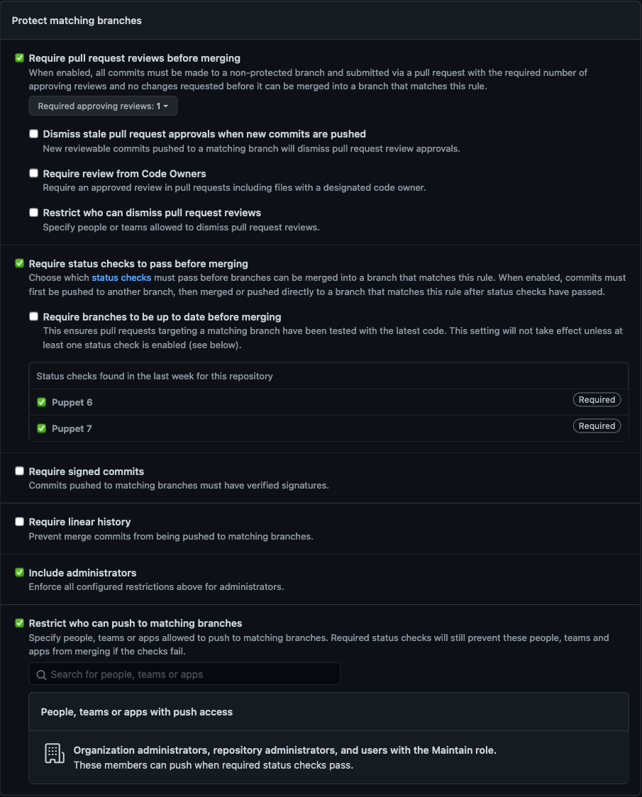

# Standards for ploperations repos

All repos within ploperations should follow these standards as closely as
possible to ensure a consistent experience across all projects

#### Table of Contents

* [Creating a new repo](#creating-a-new-repo)
  * [Repo creation with Travis-CI testing enabled](#repo-creation-with-travis-ci-testing-enabled)
  * [Label setup](#label-setup)
  * [Settings in the GitHub interface](#settings-in-the-github-interface)
* [Puppet module standards](#puppet-module-standards)
  * [PDK](#pdk)
  * [metadata.json](#metadata.json)
  * [Testing](#testing)
  * [Documentation](#documentation)
  * [License](#license)
  * [Puppet Forge](#puppet-forge)

## Creating a new repo

In the steps below we will assume you are using [Hub](https://hub.github.com/)
and the [travis gem](https://github.com/travis-ci/travis.rb).


### Repo creation with Travis-CI testing enabled

Make a local directory to be your repository root and then execute these
commands from within it:

```
git init
git add .
git commit -am 'Initial comit'
hub create -d 'some description for your repo' ploperations/<repo name>
git push -u origin master
travis enable
```

If Travis complains about not knowing about the repository you may just need to
wait a minute or two and then run `travis enable` again.

### Label setup

We utiliz a standardized set of lables to facilitate using GitHub Changelog Generator. These are maintained via `labels.rb` in [underscorgan/community_management](https://github.com/underscorgan/community_management).
To set it up you will have to create a personal access token with the repo box
checked.

Whenever a new module repo is created or any time you want to make sure our
repos have the right labels on them you can run the following command:

```
bundle exec ruby labels.rb -n ploperations -r '^ploperations-' -f -d
```

This will add or correct all needed lables and remove any extras. 

There is also a company blog post about using this tool at
https://puppet.com/blog/how-github-labels-streamline-puppet-module-release-process


### Settings in the GitHub interface

Once your repo is created you will need to go to the web interface and edit
these settings:

1. Click `Branches`
2. Click `Add rule`
3. In the `Apply rule to` box type `master`
4. Under `Rule settings` check all 5 boxes. Set them as shown here:
   
5. Click the green `Create` button at the bottom

Additionally, please follow the instructions at
https://confluence.puppetlabs.com/x/tQigBw to setup integration with Jira.


## Puppet module standards


### PDK

It is expected that all modules here are utilizing the
[PDK](https://puppet.com/docs/pdk/latest). `pdk validate` is expected to pass
both locally and via the included `.travis.yaml` (note that Travis-CI was
enabled during repo setup).


### metadata.json

It is expected that the `metadata.json` is fully populated including

- the `summary` line
- the `source`, `project_page`, and `issues_url` urls
- the dependencies
- the applicable platforms


### Testing

It is expected that all modules have rspec tests setup and that `pdk test unit`
passes. These tests should, at a minimum, contain the following in
`spec/classes/init_spec.rb`:

```ruby
require 'spec_helper'

describe '<insert module name here>' do
  on_supported_os.each do |os, facts|
    context "on #{os}" do
      it { is_expected.to compile.with_all_deps }
    end
  end
end
```

Natrually, if your module does not utilize `init.pp` then the above will need
to be adjusted. If your module contains functions then please also generate
tests that verify they work as expected.

### Documentation

It is expected that every module will have the following:

- a complete `README.md` that includes:
  - these badges just under the title
    ```markdown
    # replace <MODULE-NAME> in each badge
    
    
    
    [](https://travis-ci.org/ploperations/ploperations-<MODULE-NAME>)
    ```
  - this at the bottom:
    ```markdown
    ## Reference

    This module is documented via
    `pdk bundle exec puppet strings generate --format markdown`.
    Please see [REFERENCE.md](REFERENCE.md) for more info.

    ## Changelog

    [CHANGELOG.md](CHANGELOG.md) is generated prior to each release via
    `pdk bundle exec rake changelog`. This proecss relies on labels that are applied
    to each pull request.
    ```
- a `REFERENCE.md` that is up-to-date
- a `CHANGELOG.md` that is updated prior to each release
- all parts of the module documeted in the methodology expected by
  `puppet strings`. This includes both the untagged description and the
  `@summary` tag. Those lines may be the same but both are needed due to the
  way that `puppet strings` works. More details on how to do this can be found
  in the
  [Puppet Strings style guide](https://puppet.com/docs/puppet/6.1/puppet_strings_style.html).
- an up-to-date CHANGELOG.md generated by [GitHub Changelog Generator](https://github.com/github-changelog-generator/github-changelog-generator) via
  ```
  pdk bundle exec rake changelog
  ```

### License

All modules should contain a `LICENSE` file. Generally, an Apache 2.0 license
should be used. The [one](LICENSE) in this repo can be copied into your repo.

### Puppet Forge

Once all the above have been done it is expected that modules are deployed to
the Puppet Forge under the `ploperations` user. Once that initial push has been
done it is also expected that the `Puppetfile` in our control repo pulls from
the Forge.


# Contributions to these standards

PR's are welcome
